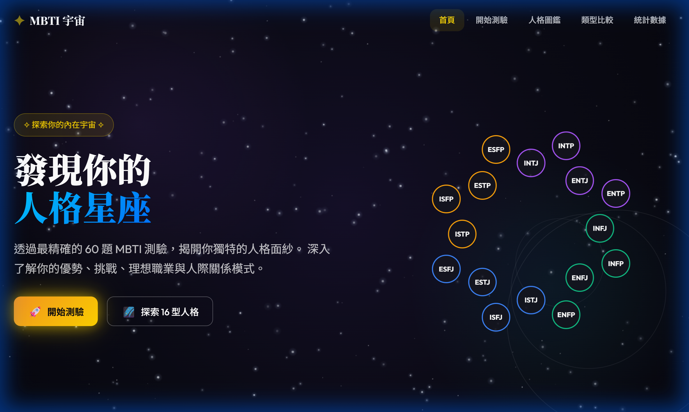

# 🌌 MBTI 宇宙 (MBTI Universe)

> 探索你的內在宇宙，發現屬於你的人格星座。



## ✨ 專案簡介

**MBTI 宇宙** 是一個採用 **Art Deco 宇宙美學風格** 打造的現代化 MBTI 人格分析網站。
不同於傳統枯燥的測驗介面，我們透過沈浸式的星空動畫、優雅的互動設計與深度的心理學解析，為用戶提供一場探索自我的視覺饗宴。

本專案為 **純前端 (Vanilla JS)** 實作，無須後端依賴，極致輕量且效能優異。

🔗 **線上預覽**: [點擊前往 (請在 GitHub Settings 設定後生效)](https://milugotlost.github.io/mbtitest/)

## 🚀 功能亮點

- **🔮 沉浸式視覺體驗**
  - 動態 Canvas 星空粒子背景與流星效果
  - 獨特的紫色/青色星雲氛圍
  - 16 種人格類型的動態軌道預覽

- **📝 專業級人格測驗**
  - 收錄 60 道精心設計的心理測驗題目
  - 精確計算四大維度 (E/I, S/N, T/F, J/P) 的傾向百分比
  - 即時進度顯示與互動式作答體驗

- **📖 深度人格圖鑑**
  - 完整收錄 16 型人格詳細解析 (每篇 1000+ 字)
  - 包含核心特質、優勢/盲點、職業建議、名人代表
  - 獨家的「認知功能堆疊」視覺化分析

- **⚖️ 互動比較工具**
  - 支援任意兩種類型的即時對比
  - 分析認知功能差異與關係相容性
  - 提供具體的相處建議

- **📊 數據統計中心**
  - 全球人口分布圓環圖
  - 類型稀有度即時排名

## 🛠️ 技術棧

- **HTML5**: 語意化標籤，SEO 優化
- **CSS3**: 
  - CSS Variables (設計系統)
  - CSS Animations & Keyframes
  - Flexbox & Grid Layout
  - Glassmorphism (毛玻璃效果)
- **JavaScript (ES6+)**:
  - Vanilla JS (無框架依賴)
  - Canvas API (粒子動畫)
  - LocalStorage (測驗結果儲存)
  - Class-based Architecture (模組化設計)

## 📦 安裝與使用

由於是純靜態網站，您無需安裝任何依賴即可運行。

### 本地開發

1. **複製專案**
   ```bash
   git clone https://github.com/milugotlost/mbtitest.git
   cd mbtitest
   ```

2. **啟動伺服器** (推薦使用 Live Server)
   
   如果您有安裝 VS Code：
   - 安裝 "Live Server" 插件
   - 右鍵點擊 `index.html` -> "Open with Live Server"

   或者使用 Node.js：
   ```bash
   npx live-server
   ```

3. **直接開啟**
   直接用瀏覽器雙擊開啟 `index.html` 也可以瀏覽大部分功能。

## 🚢 部署說明

本專案已包含 GitHub Actions 設定，可自動部署至 GitHub Pages。

1. 到本倉庫的 **Settings** > **Pages**
2. 在 **Build and deployment** 下的 **Source** 選擇 **GitHub Actions**
3. 之後每次推送到 `main` 分支，GitHub 就會自動建置並部署網站。

---

<p align="center">
  Made with ❤️ by Antigravity Agent
</p>
